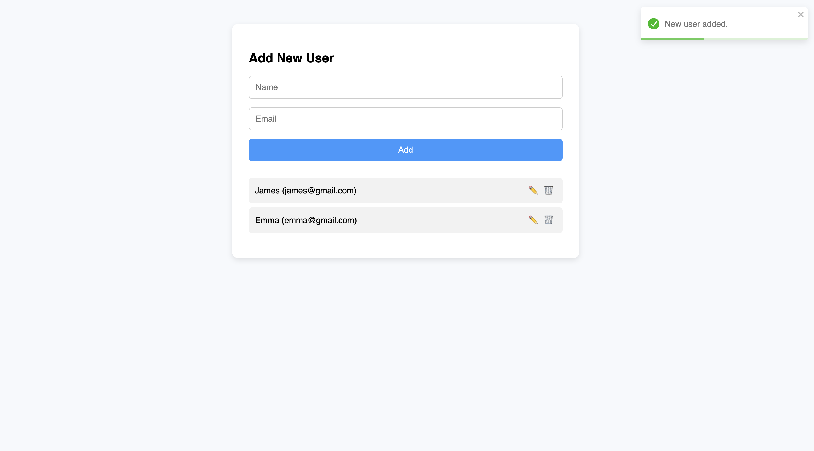

# 🌐 Mini Fullstack Project — React + Express + PostgreSQL (Dockerized)

A fullstack CRUD application built with:

- ⚙️ **Backend**: Node.js, Express, Prisma, PostgreSQL
- 🧩 **Frontend**: React, Axios, React Hook Form, Sass, Toastify
- 🐳 **Dockerized** for consistent development and easy deployment

---

## 📦 Features

- Create, read, update, delete users (CRUD)
- RESTful API with Prisma ORM
- Styled UI with React and SCSS
- Form validation with React Hook Form + Yup
- Notification system with Toastify
- Fully containerized with Docker and Docker Compose

---

## 🏗 Project Structure

```text
mini-fullstack-project/
├── backend/                 # Express.js backend with Prisma + PostgreSQL
│   ├── prisma/              # Prisma schema and migrations
│   └── src/service.js       # Main backend service
├── frontend/                # React app using Vite
│   ├── src/api/axios.js     # Axios
│   ├── src/pages/Users.jsx  # CRUD UI
│   └── styles/main.scss     # Frontend styling
├── docker-compose.yml       # Multi-service setup
└── README.md                # You're here
```

---

## 🚀 Getting Started

### 1. Clone the Repository

```bash
git clone https://github.com/axmadvsss/mini-fullstack-project.git
cd mini-fullstack-project
```

### 2. Start Backend and Database via Docker

```bash
docker-compose up --build
```

### 3. Run Prisma Migrations (inside container)

```bash
docker-compose exec backend npx prisma migrate dev --name init
```

### 4. Start Frontend (in a separate terminal)

```bash
cd frontend
npm install
npm run dev
```

Visit your app at: [http://localhost:5173](http://localhost:5173)

---

## 🔌 Backend API

Base URL: `http://localhost:5050`

| Method | Endpoint        | Description          |
|--------|------------------|----------------------|
| GET    | `/users`         | Get all users        |
| POST   | `/users`         | Create new user      |
| PUT    | `/users/:id`     | Update a user        |
| DELETE | `/users/:id`     | Delete a user        |

---

## 🧪 Sample Payload

```json
{
  "name": "Ali",
  "email": "ali@example.com"
}
```

---

## 🖼 UI Preview



---

## 📜 License

This project is licensed under the **MIT License** — use it freely, modify it, and learn from it.

---

## 👨‍💻 Author

Created with ❤️ by **Madamin Axmadov**, 2025
